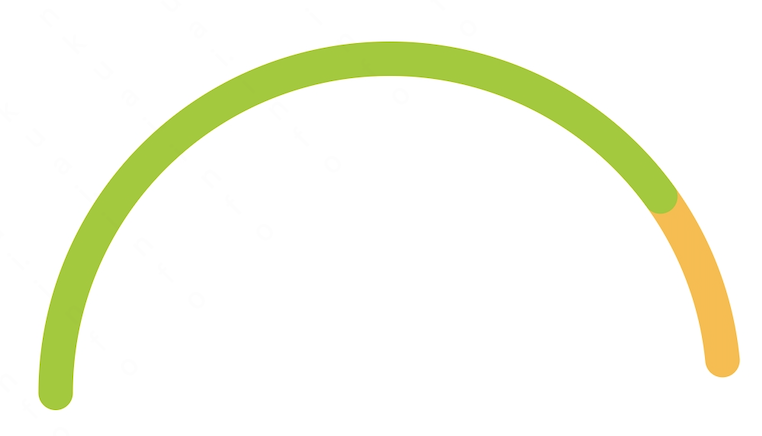
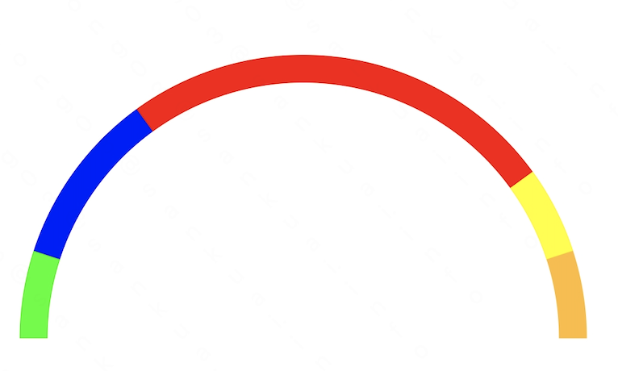

# RingChartView
[](https://jitpack.io/#kerwin162/RingChartView)

一个自定义的环形Android图表
#### 导入方式
```gradle
    //工程根目录build.gradle文件配置jitpack仓库
    repositories {
        maven { url "https://jitpack.io" }
    }
    
    //在module目录的build.gradle配置依赖导入
    implementation 'com.github.kerwin162:RingChartView:1.0.32'
```

#### 部分说明
##### 1. 完整环形图表
```xml
   <top.itjl.ringchartview.RingChartView
        android:id="@+id/ring_chart_view1"
        android:layout_height="wrap_content"
        android:layout_width="match_parent"
        app:progress="70"
        app:paintCap="ROUND"
        app:chartAngleStyle="FULL_CIRCLE"
        app:paintWidth="15dp"
        app:progressColor="@android:color/holo_green_light"
        app:backColor="@android:color/holo_orange_light"
        android:padding="20dp"/>
```


##### 2. 半环形图表
```xml
    <top.itjl.ringchartview.RingChartView
        android:id="@+id/ring_chart_view3"
        android:layout_height="wrap_content"
        android:layout_width="match_parent"
        app:maxValue="100"
        app:progress="80"
        app:progressColor="@android:color/holo_green_light"
        app:backColor="@android:color/holo_orange_light"
        app:chartAngleStyle="HALF_CIRCLE"
        app:paintWidth="15dp"
        android:padding="20dp"/>
```


##### 3. 多层形图表
```xml
   <top.itjl.ringchartview.RingChartView
        android:id="@+id/ring_chart_view2"
        android:layout_height="wrap_content"
        android:layout_width="match_parent"
        app:maxValue="100"
        app:progress="30"
        app:paintCap="SQUARE"
        app:progressColor="@android:color/holo_green_light"
        app:backColor="@android:color/holo_orange_light"
        app:chartAngleStyle="HALF_CIRCLE"
        app:paintWidth="15dp"
        android:padding="20dp"/>
```
```java
    ringChartView2.setMultiProgress(true);
    List<RingChartView.ProgressNode> nodeList=new ArrayList<>();
    nodeList.add(new RingChartView.ProgressNode(10, Color.GREEN));
    nodeList.add(new RingChartView.ProgressNode(20, Color.BLUE));
    nodeList.add(new RingChartView.ProgressNode(50, Color.RED));
    nodeList.add(new RingChartView.ProgressNode(10, Color.YELLOW));
    ringChartView2.setProgressNodes(nodeList);
```



##### 4. 部分字段参数说明

| 字段名          | 说明                                                         | 默认值       | 是否支持xml配置                    |
| --------------- | ------------------------------------------------------------ | ------------ | ---------------------------------- |
| maxValue        | 图表最大值                                                   | 100          | YES                                |
| progress        | 进度值                                                       | 0            | YES                                |
| minProgress     | 最小进度值，<br />用来解决进度太小不显示问题，为默认可显示的进度最小粒度 | 1            | YES                                |
| paintCap        | 进度条头部是圆头还是平头（SQUARE/ROUND）                     | ROUND        | YES                                |
| paintWidth      | 画笔宽度，及进度条宽度                                       | 40px         | YES                                |
| chartAngleStyle | 图表圆弧类型（HALF_CIRCLE、FULL_CIRCLE）全环形还是半环形     | HALF_CIRCLE  | YES                                |
| multiProgress   | 是否支持多进度数据                                           | false        | YES                                |
| progressNodes   | 多进度节点设置                                               | 无           | NO，通过setProgressNodes()方法设置 |
| backColor       | 进度条背景色                                                 | Color.LTGRAY | YES                                |
| progressColor   | 进度条前景色（multiProgress=false时生效）                    | Color.GREEN  | YES                                |
|                 |                                                              |              |                                    |

