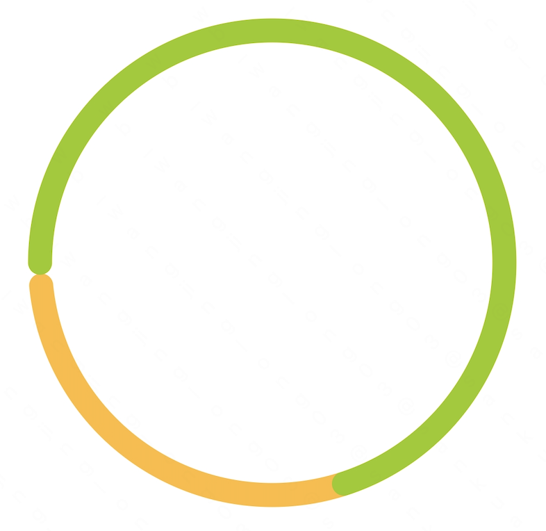

## RingChartView
[](https://jitpack.io/#kerwin162/RingChartView)

Android自定义环形图表组件 - 支持全环/半环样式、多段进度条显示及丰富定制化配置

### 功能特性
- ✅ 全环形 & 半环形两种基础样式
- 🎨 单色/多段颜色进度条组合
- 🔧 可定制的画笔宽度与端点形状（圆头/平头）
- 📊 最小粒度控制（解决极小进度不可见问题）
- ⚡ XML属性直接配置 + Java动态设置双模式

### 快速接入
#### Step1. 添加JitPack仓库 (Project级 build.gradle)
```gradle
allprojects {
    repositories {
        maven { url "https://jitpack.io" }
    }
}
```

#### Step2. 添加依赖 (Module级 build.gradle)
```gradle
dependencies {
    implementation 'com.github.kerwin162:RingChartView:{latest_version}'
}
```
*最新版本号请查看[JitPack徽章](#ringchartview)*

### 使用示例
#### A. XML布局用法示例

##### I. Full Circle Chart (完整环形)
```xml
<top.itjl.ringchartview.RingChartView 
    android:layout_width="match_parent"
    android:layout_height="wrap_content"
    app:progress="70"
    app:paintCap="ROUND"
    app:chartAngleStyle="FULL_CIRCLE"
    app:paintWidth="15dp"
    app:progressColor="@android:color/holo_green_light"/>
```


##### II.Half Circle Chart (半环形)
```xml 
<top.itjl.ringchartview.RingChartView 
    ...
app:maxValue="100"    
app:chartAngleStyle="HALF_CIRCLE"/>
```


---

#### B.Java动态配置（多段进度）

##### III.Multi-Layer Progress Chart （多层分段）
1.XML基础配置：
```xml 
<top.itjl.ringchartview.RingChartView  
   ...   
app:multiProgress=true />
```

2.Java代码设置数据：
```java 
List<RingChartView.ProgressNode> nodeList = new ArrayList<>();
nodeList.add(new ProgressNode(10, Color.GREEN)); //数值+颜色  
nodeList.add(new ProgressNode(20, Color.BLUE));
//...其他节点  

yourRingChart.setProgressNodes(nodeList);
```


---

### API参考手册 
| 属性              | 描述                                  | 默认值       | XML支持     |
|-------------------|--------------------------------------|--------------|-------------|
| maxValue          | 图表的最大刻度值                      | `100`        | ✅           |
| progress          | 当前进度值                            | `0`          | ✅           |
| minProgress       | 可视化的最小进度颗粒度                | `1`          | ✅           |
| paintCap           | 线段端头风格 (`ROUND/SQUARE`)        | ROUND       |✅         |
| paintWidth         |线段粗细（单位：dp/尺寸）           |`40　`　　    |　✅    |
| backColor         |  背景色                             |    Color.LTGRAY     ✅    |
| progressColor      |  前景色（进度条颜色）              | Color.GREEN   |  ✅      |      
|multiProgress     |是否开启多段式进度条模式      | false    |     ❌(需通过set方法) |


**高级方法**:
```java 
// Set multiple segments data (需先开启multiProgress模式)
void setProgressNodes(List<ProgressNode> nodes)

// Dynamic update single progress value （单色模式下有效）
void setCurrentValue(int value) 

// Customize start angle for half-circle （默认180°水平起始）
void setStartAngle(float degree)  
```

---

### Q&A常见问题
 
Q：为什么设置了小数值没有显示？
A：确保minProgess值小于等于目标值；若仍无效尝试增大paintWidth尺寸
 
Q：如何实现渐变效果？
A：目前暂不支持渐变色填充计划v2.x版本将增加此特性
 
Q：能否调整起始角度？
A：可通过调用setStartAngle()方法进行旋转角度调整


---
**[🐛 Issue Tracker]** [https://github.com/kerwin162/RingChar​tVie​w/issues](https://github.com/ispace-top/RingChartView/issues)<br>


*欢迎Star⭐️ & PR！*
